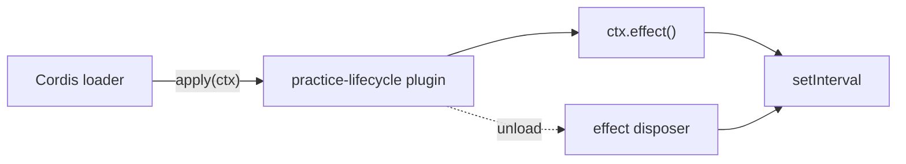

# dsh-plugin-practice

A minimal practice repository for learning DeepSeek Harness plugin development one concept at a time.

## Lesson 1: plugin lifecycle

This first example keeps the surface area deliberately small. It demonstrates only:

- a Cordis function plugin;
- the `apply(ctx)` entry point;
- lifecycle-owned resources with `ctx.effect()`;
- loading the plugin into DSH with a patch file.

### Files

```text
dsh-plugin-practice/
├── README.md
├── cordis.patch.yml
└── src/
    └── plugin.ts
```

### Plugin

`src/plugin.ts` contains a small heartbeat resource:

```ts
import type { Context } from '@deepseek-ai/cordis'

export const name = 'practice-lifecycle'

export function apply(ctx: Context): void {
  console.log('[practice-lifecycle] loaded')

  ctx.effect(() => {
    const timer = setInterval(() => {
      console.log('[practice-lifecycle] heartbeat')
    }, 5_000)

    return () => {
      clearInterval(timer)
      console.log('[practice-lifecycle] disposed')
    }
  }, 'practice-lifecycle.heartbeat()')
}
```

The important relationship is:



The timer is created by the plugin effect and its cleanup function is owned by the same lifecycle. When the plugin is unloaded or replaced, Cordis runs the disposer.

## Load it from a DSH source checkout

The patch file contains a placeholder because the local TypeScript module must be referenced by an absolute path when it is loaded as an external patch during this exercise.

1. Clone this repository somewhere on your machine.
2. Edit `cordis.patch.yml` and replace `/ABSOLUTE/PATH/TO/dsh-plugin-practice` with the repository's absolute path.
3. From the `deepseek-harness` source checkout, run:

```sh
pnpm dsh web --patch /ABSOLUTE/PATH/TO/dsh-plugin-practice/cordis.patch.yml
```

4. Watch the terminal. You should see:

```text
[practice-lifecycle] loaded
[practice-lifecycle] heartbeat
```

When the plugin is unloaded or replaced, you should also see:

```text
[practice-lifecycle] disposed
```

## What to understand before Lesson 2

For now, focus on four questions:

1. Who calls `apply(ctx)`?
2. What does the `ctx` object represent?
3. Why is the timer created inside `ctx.effect()`?
4. What event causes the disposer returned from `ctx.effect()` to run?

Once these are clear, the next lesson can add `inject = ['tools']` and register a real DSH Tool without treating the framework as a black box.
