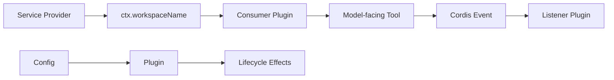

# dsh-plugin-practice

用于学习 DeepSeek Harness / Cordis 插件开发的最小练习仓库。代码按课程逐步累积，同时也可以作为一个真正的 DSH Bundle 构建、打包并安装到本机 profile。

当前内容覆盖：Plugin lifecycle、Tool、Config、Service / Consumer、Event。

## 当前结构

```text
dsh-plugin-practice/
├── src/
│   ├── plugin.ts
│   ├── workspace-info.ts
│   ├── configurable-greet.ts
│   ├── workspace-name-service.ts
│   ├── workspace-name-tool.ts
│   ├── workspace-event-contract.ts
│   ├── workspace-event-emitter.ts
│   └── workspace-event-listener.ts
├── scripts/
│   └── deploy.mjs
├── cordis.patch.yml
├── cordis.dev.patch.yml
├── package.json
├── tsconfig.json
└── tsdown.config.ts
```

`cordis.patch.yml` 是正式 Bundle 安装使用的 patch，里面通过 `dsh-plugin-practice/<subpath>` 加载构建产物。

`cordis.dev.patch.yml` 是学习和本地源码调试使用的 overlay，直接指向 `.ts` 源文件。

## 环境要求

- Node.js `^22.19.0 || >=24.0.0`
- pnpm（仓库声明 `pnpm@11.7.0`）
- 本机已经安装可直接执行的 `dsh` CLI

可以先运行 `dsh --help` 确认 CLI 可用。

## 推荐方式：构建、打包、安装一条龙

克隆仓库并安装开发依赖：

```sh
git clone https://github.com/Ri0n72Y/dsh-plugin-practice.git
cd dsh-plugin-practice
pnpm install
```

先做类型检查和构建：

```sh
pnpm run check
```

然后安装到 DSH profile。默认 profile 名为 `practice`：

```sh
pnpm run deploy
```

也可以指定 profile：

```sh
pnpm run deploy -- --profile demo
```

`deploy` 会依次完成：

```text
pnpm run build
→ 生成 lib/*.js
→ npm pack 生成预构建 .tgz
→ dsh plugin --profile <profile> add <tarball>
→ dsh --profile <profile> --dump-config
```

打包产物临时放在 `.dsh-pack/`，不会提交到 Git。

安装成功后启动：

```sh
dsh --profile practice
```

## 使用 npx 一条命令安装

如果希望直接从 GitHub 拉取源码、构建并安装，可以执行：

```sh
npx --yes --package=github:Ri0n72Y/dsh-plugin-practice dsh-plugin-practice --profile practice
```

这条命令会运行包的 `prepare` 构建脚本，然后调用同一个部署 CLI。Git 源安装会在本机执行仓库代码；只应对你信任的源码使用这种方式。需要固定版本时，可以在 GitHub package spec 后附 commit SHA。

## Bundle 是如何安装的

`package.json` 声明：

```json
{
  "dsh": {
    "bundle": {
      "patch": "./cordis.patch.yml"
    }
  }
}
```

构建后，`cordis.patch.yml` 中的插件行会从已安装包解析，例如：

```yaml
- insert:
    - id: practice-workspace-info
      name: 'dsh-plugin-practice/workspace-info'
```

这与开发模式下直接加载绝对路径 `.ts` 文件是两条独立路径。

## 源码开发 / overlay 模式

如果要继续逐课修改源码并直接观察插件行为，可以使用 `cordis.dev.patch.yml`。

先把文件中的：

```text
/ABSOLUTE/PATH/TO/dsh-plugin-practice
```

替换为仓库真实绝对路径，然后运行：

```sh
dsh web --patch /ABSOLUTE/PATH/TO/dsh-plugin-practice/cordis.dev.patch.yml
```

如果你是在 DeepSeek Harness 源码仓库中运行 CLI，也可以使用官方源码入口：

```sh
pnpm dsh web --patch /ABSOLUTE/PATH/TO/dsh-plugin-practice/cordis.dev.patch.yml
```

## 当前课程内容

| Lesson | 文件 | 核心概念 |
|---|---|---|
| 1 | `src/plugin.ts` | `apply(ctx)`、`ctx.effect()`、disposer、插件生命周期 |
| 2 | `src/workspace-info.ts` | `inject = ['tools']`、`defineTool()`、参数与 canonical output |
| 3 | `src/configurable-greet.ts` | `Config` interface、Schemastery、默认值、运行时配置校验 |
| 4 | `src/workspace-name-service.ts` + `workspace-name-tool.ts` | Service Provider、Context declaration merging、Consumer / inject |
| 5 | `workspace-event-*` | typed Events、`ctx.emit()`、`ctx.on()`、松耦合广播 |

整体关系：



## 安装后测试

启动目标 profile：

```sh
dsh --profile practice
```

然后在 Agent 中分别测试：

```text
Use the workspace_info tool and tell me the current workspace.
Use configured_greet to greet Ada.
Use workspace_name and return only the workspace name.
Use announce_workspace to announce the current workspace.
```

预期行为：

- `workspace_info` 返回当前 DSH Node 进程的 `cwd` 和目录名。
- `configured_greet` 使用 Bundle 配置中的 `greeting: Hi`，例如返回 `Hi, Ada!`。
- `workspace_name` 通过自定义 `ctx.workspaceName` Service 取得目录名。
- `announce_workspace` 发出 `practice/workspace-announced`，监听插件在终端输出 `[workspace-event] announced: <name>`。
- Lesson 1 插件运行时每 5 秒输出一次 `[practice-lifecycle] heartbeat`；卸载时输出 `disposed`。

也可以单独检查最终组合配置：

```sh
dsh --profile practice --dump-config
```

应能看到 `dsh-plugin-practice` Bundle 层以及本仓库定义的插件行。

## 卸载

```sh
dsh plugin --profile practice remove dsh-plugin-practice
```

卸载后，Cordis 会清理本 Bundle 注册的 Tool、Event listener 和其他 lifecycle effects。

## 常用开发命令

```sh
pnpm run typecheck
pnpm run build
pnpm run check
pnpm run pack:plugin
pnpm run deploy -- --profile practice
```

`build` 使用 `tsdown` 将每个练习入口编译到 `lib/`；`prepare` 使用同一构建配置，因此 Git package 安装也能从源码生成运行时产物。

## 版本说明

这个练习仓库跟随 DeepSeek Harness 当前开发版本学习，DSH 仍处于快速迭代阶段。`package.json` 中 Cordis / DSH peer dependency 范围按当前官方仓库版本设置；如果未来 DSH 出现 breaking change，应先对照官方插件开发文档和实际 TypeScript 接口再升级依赖。
