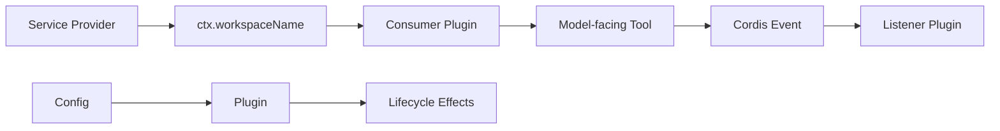

# dsh-plugin-practice

用于学习 DeepSeek Harness / Cordis 插件开发的最小练习仓库。代码按课程逐步累积，同时也可以作为一个标准 DSH Bundle 安装进 profile。

当前内容覆盖：Plugin lifecycle、Tool、Config、Service / Consumer、Event。

## 当前结构

```text
dsh-plugin-practice/
├── src/
│   ├── plugin.ts
│   ├── workspace-info.ts
│   ├── configurable-greet.ts
│   ├── workspace-name-service.ts
│   ├── workspace-name-tool.ts
│   ├── workspace-event-contract.ts
│   ├── workspace-event-emitter.ts
│   └── workspace-event-listener.ts
├── cordis.patch.yml
├── cordis.dev.patch.yml
├── package.json
├── tsconfig.json
└── tsdown.config.ts
```

`cordis.patch.yml` 是正式 Bundle 使用的 patch；`cordis.dev.patch.yml` 用于直接加载本地 TypeScript 源码。

## 环境要求

- Node.js `^22.19.0 || >=24.0.0`
- pnpm（仓库声明 `pnpm@11.7.0`）
- 本机已经安装可直接执行的 `dsh` CLI

先运行：

```sh
dsh --help
```

确认 CLI 可用。

## 本地开发与一键部署

克隆仓库并安装依赖：

```sh
git clone https://github.com/Ri0n72Y/dsh-plugin-practice.git
cd dsh-plugin-practice
pnpm install
```

日常开发完成后，直接执行：

```sh
pnpm deploy
```

`deploy` 在 `package.json` 中定义为：

```json
{
  "scripts": {
    "deploy": "pnpm run prepare && dsh plugin --profile practice add ."
  }
}
```

因此一条命令会完成：

```text
src/*.ts
→ pnpm run prepare
→ tsdown 构建 lib/*.js
→ dsh plugin --profile practice add .
→ 当前 checkout 安装 / 更新进 practice profile
```

写完一课代码后，通常只需要：

```sh
pnpm deploy
```

然后启动 DSH：

```sh
dsh --profile practice
```

如果想先检查最终组合配置：

```sh
dsh --profile practice --dump-config
```

默认开发 profile 目前固定为 `practice`；需要修改时直接调整 `package.json` 中的 `deploy` script。

## 直接使用 DSH 官方命令安装

`pnpm deploy` 只是把构建和官方安装命令串起来。真正负责插件安装和 profile 管理的仍然是 DSH：

```sh
dsh plugin --profile practice add .
```

`dsh plugin` 会负责初始化 / 更新 profile，并把声明了 `dsh.bundle` 的当前包加入 profile 的 bundle 列表。

## 直接从 GitHub 安装

DSH 官方也支持直接安装 Git 仓库：

```sh
dsh plugin --profile practice add github:Ri0n72Y/dsh-plugin-practice
```

本仓库是 TypeScript 包，因此 `package.json` 提供了 `prepare`：Git 安装完成后由 pnpm 从 `src/` 构建 `lib/`。

pnpm 10+ 默认会阻止 Git 依赖运行构建脚本。第一次安装如果 DSH / pnpm 提示需要授权，请按终端给出的包名在该 profile 的 `pnpm-workspace.yaml` 中加入 `allowBuilds`，然后重新执行安装。例如：

```yaml
allowBuilds:
  dsh-plugin-practice: true
```

只应对可信源码开放安装期构建权限。需要固定版本时，可以在 GitHub spec 后加 commit SHA。

## Bundle manifest

`package.json` 通过官方约定声明当前包是一个 DSH Bundle：

```json
{
  "dsh": {
    "bundle": {
      "patch": "./cordis.patch.yml"
    }
  }
}
```

正式 patch 通过包导出路径加载构建后的插件：

```yaml
- insert:
    - id: practice-workspace-info
      name: 'dsh-plugin-practice/workspace-info'
```

安装关系是：

```text
pnpm deploy
→ prepare / build
→ dsh plugin add .
→ package.json / dsh.bundle
→ cordis.patch.yml
→ dsh-plugin-practice/<subpath>
→ lib/*.js
```

## 源码开发 / overlay 模式

如果继续逐课修改源码并希望直接加载 `.ts` 文件，可以使用 `cordis.dev.patch.yml`。

先把其中的：

```text
/ABSOLUTE/PATH/TO/dsh-plugin-practice
```

替换为仓库真实绝对路径，然后运行：

```sh
dsh web --patch /ABSOLUTE/PATH/TO/dsh-plugin-practice/cordis.dev.patch.yml
```

如果从 DeepSeek Harness 源码仓库运行 CLI，也可以使用：

```sh
pnpm dsh web --patch /ABSOLUTE/PATH/TO/dsh-plugin-practice/cordis.dev.patch.yml
```

## 当前课程内容

| Lesson | 文件 | 核心概念 |
|---|---|---|
| 1 | `src/plugin.ts` | `apply(ctx)`、`ctx.effect()`、disposer、插件生命周期 |
| 2 | `src/workspace-info.ts` | `inject = ['tools']`、`defineTool()`、参数与 canonical output |
| 3 | `src/configurable-greet.ts` | `Config` interface、Schemastery、默认值、运行时配置校验 |
| 4 | `src/workspace-name-service.ts` + `workspace-name-tool.ts` | Service Provider、Context declaration merging、Consumer / inject |
| 5 | `workspace-event-*` | typed Events、`ctx.emit()`、`ctx.on()`、松耦合广播 |



## 安装后测试

启动目标 profile：

```sh
dsh --profile practice
```

然后在 Agent 中测试：

```text
Use the workspace_info tool and tell me the current workspace.
Use configured_greet to greet Ada.
Use workspace_name and return only the workspace name.
Use announce_workspace to announce the current workspace.
```

预期行为：

- `workspace_info` 返回当前 DSH Node 进程的 `cwd` 和目录名。
- `configured_greet` 使用 Bundle patch 中的 `greeting: Hi`，例如返回 `Hi, Ada!`。
- `workspace_name` 通过自定义 `ctx.workspaceName` Service 获取目录名。
- `announce_workspace` 发出 `practice/workspace-announced`，监听插件在终端输出 `[workspace-event] announced: <name>`。
- Lesson 1 插件运行时每 5 秒输出一次 `[practice-lifecycle] heartbeat`；卸载时输出 `disposed`。

## 卸载

```sh
dsh plugin --profile practice remove dsh-plugin-practice
```

## 常用开发命令

```sh
pnpm run typecheck
pnpm run build
pnpm run check
pnpm deploy

dsh --profile practice --dump-config
dsh --profile practice
```

## 版本说明

这个练习仓库跟随 DeepSeek Harness 当前开发版本学习。DSH 仍处于快速迭代阶段；如果 API 发生 breaking change，应优先对照官方开发文档和当前 TypeScript 接口调整。
